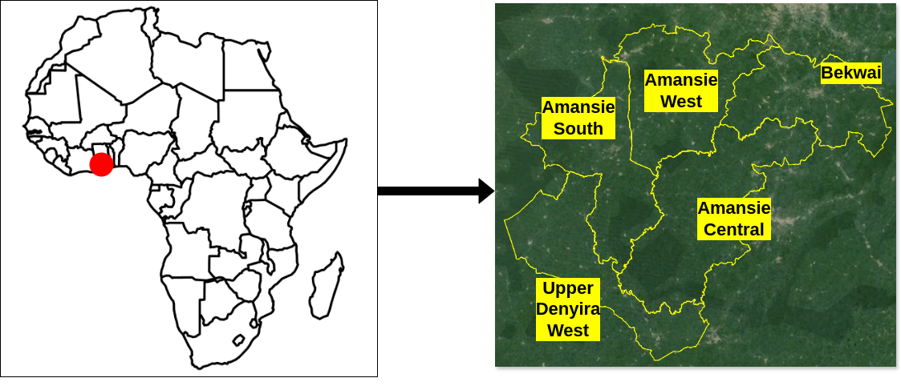
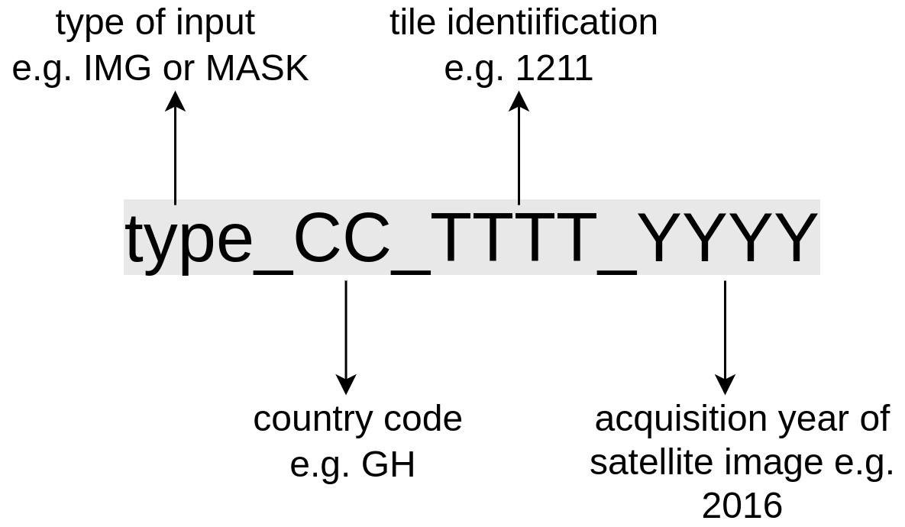
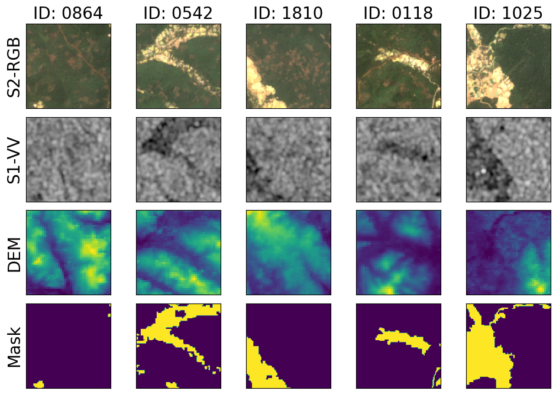

## SmallMinesDS
The gradual expansion of unregularized artisanal small-scale gold mining (ASGM) fuels environmental degradation and poses risk to miners and mining communities. To enforce sustainable mining, support reclamation initiatives and pave the way for understudying the impacts of mining, we present SmallMinesDS, a benchmark dataset for mapping artisanal small-scale gold mining from multi-sensor satellite images. The initial version of the dataset covers five districts in Southwestern Ghana in two time periods. 
The first version of SmallMinesDS covers five administrative districts in Southwestern Ghana with a ground area of about 3200 sq.km. 
SmallMinesDS includes satellite images from optical and radar sensors in the dry season (January) for two years (2016 and 2022). 
The area covered is ecologically diverse, hosting rich biodiversity and serving as a hub for multiple land-use activities, 
including crop cultivation, forestry, industrial and small-scale gold mining. 
This multifaceted landscape underscores the importance of reliable mapping and monitoring of ASGM activities.





## FOLDER STRUCTURE
**Year**
- IMAGE
- MASK


## NAMING CONVENTION




## INPUT DATA DESCRIPTION
SmallMines contains 13 bands for each image and a binary label.
The order of the bands for the images is as follows:

- Index 0-9   ==> Sentinel-2 L2A [blue, green, red, red edge 1, red edge2, red edge 3, near infrared, red edge 4, swir1, swir2]
- Index 10-11 ==> Sentinel-1 RTC + speckle filtered [vv, vh]
- Index 12    ==> Copernicus DEM [dem]


Each patch has an input shape of ```13 x 128 x 128``` and a corresponding mask of ```1 x 128 x 128```

In total there are ```4270``` patches; ```2175``` each for 2016 and 2022.




## CITATION
If you use the dataset or supporting code in your research, please cite `SmallMinesDS` as :

```
@ARTICLE{10982207,
  author={Ofori-Ampofo, Stella and Zappacosta, Antony and Kuzu, Rıdvan Salih and Schauer, Peter and Willberg, Martin and Zhu, Xiao Xiang},
  journal={IEEE Geoscience and Remote Sensing Letters}, 
  title={SmallMinesDS: A Multimodal Dataset for Mapping Artisanal and Small-Scale Gold Mines}, 
  year={2025},
  volume={22},
  number={},
  pages={1-5},
  keywords={Data mining;Foundation models;Gold;Satellite images;Sentinel-1;Optical sensors;Laser radar;Biological system modeling;Spaceborne radar;Radar imaging;Earth observation;foundation models (FMs);machine learning;mining;semantic segmentation},
  doi={10.1109/LGRS.2025.3566356}}

```

## OUTLOOK
Looking ahead, we plan to expand the dataset to include additional regions in Africa, South America, and Asia where ASGM activities are prevalent. 
This expansion will enable the representation of cross-regional variations in ASGM practices, reflecting the diverse operational characteristics of mining activities globally
